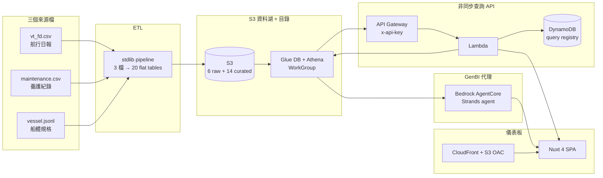

# 船隊效能分析平台系統建議書

### Fleet Performance Analytics Platform — System Proposal

---

| 項目 | 內容 |
|---|---|
| **文件名稱** | 船隊效能分析平台系統建議書 (Fleet Performance Analytics Platform — System Proposal) |
| **提報對象 (Prepared for)** | 陽明海運股份有限公司 (Yang Ming Marine Transport Corporation) |
| **主題** | 主機油耗預測 (main-engine fuel-consumption prediction) 與 ISO 19030 速度損失儀表板 (Speed Loss Dashboard) 之導入 |
| **版本 (Version)** | v1.0 |
| **日期 (Date)** | 2026-07-15 |
| **狀態** | 正式建議書 — 導入導向 (implementation-oriented proposal) |

> **關於本建議書的定位與數據誠信聲明**
> 本建議書所載之技術能力與量化結果，係基於一份 15 艘船、涵蓋約 5 年營運期間的**示範資料集 (demonstration dataset)** 所建置並驗證的**原型 (prototype)**。凡涉及**美元金額 (USD)、地理座標與航線**之數據，其原始來源為示範資料集之合成疊加層 (synthetic overlay)，本文一律標示為「**示範資料集之示意**」；所有成本模型 (cost model) 均框定為「**將以貴司實際成本校準 (to be calibrated with Yang Ming's actual costs)**」。本建議書不將任何合成金額當作對貴司的節省保證。技術準確度指標（如 ISO 速度損失、機器學習精度）則係在真實資料上量測所得。

---

## 目錄

1. 執行摘要 (Executive Summary)
2. 業務背景與挑戰
3. 建議方案總覽
4. 系統總體架構
5. 核心模組一：資料湖與 ISO 19030 分析引擎
6. 核心模組二：主機油耗預測模型
7. 核心模組三：Speed Loss Dashboard（決策支援介面）
8. 核心模組四：GenBI Copilot（自然語言智慧分析）
9. 智慧養護與航速決策優化
10. 商業效益與價值
11. 導入規劃與藍圖 (Roadmap)
12. 結論
13. 附錄

---

## 1. 執行摘要 (Executive Summary)

### 1.1 痛點

貨櫃船在營運週期中，船殼汙損 (hull fouling) 與螺旋槳粗糙度 (propeller roughness) 會持續累積，導致推進效能 (propulsion performance) 逐步衰退：在相同主機功率下，實際船速下降，為維持船期，主機必須輸出更多功率、消耗更多燃油。此一衰退具有三項難以量化的特性：

- **效能衰退缺乏客觀量化基準** — 船速下降同時受汙損、天候、洋流、裝載狀態等因素混雜影響，肉眼與經驗難以分離「汙損造成的損失」與「當日海況造成的損失」。
- **養護時機憑經驗判斷** — 水下清洗 (underwater cleaning, UWC)、螺旋槳拋光 (propeller polishing, PP) 與進塢 (dry dock, DD) 的排程多依賴船齡與定期慣例，缺乏「清潔一次能省多少燃油、何時清最划算」的量化依據。
- **油耗難以預測** — 主機全速油耗 (main-engine full-speed fuel consumption) 隨船體狀態、環境與裝載動態變化，難以在給定條件下事前推估，不利於航次成本估算與燃油採購規劃。

上述痛點又疊加了日益嚴格的**碳強度指標 (Carbon Intensity Indicator, CII)** 法規壓力：依國際海事組織 (International Maritime Organization, IMO) MEPC.352–354(78) 決議，自 2023 年起船舶須逐年達成 A–E 評級，且要求線 (required line) 每年較 2019 年基準折減 Z%（2023–2026 分別為 5/7/9/11%）。效能衰退直接推升碳排強度，使汙損管理從「省油議題」升級為「合規議題」。

### 1.2 建議方案 — 四大能力

本建議書提出一套**一站式船隊效能資料湖平台 (fleet performance data lake platform)**，以四項核心能力回應上述痛點：

| # | 核心能力 | 回應的痛點 |
|---|---|---|
| 一 | **主機油耗預測模型** — 混合物理啟發式 (hybrid physics-informed) XGBoost 模型，於給定航行/環境條件下推估主機全速油耗 | 油耗難預測 |
| 二 | **ISO 19030 Speed Loss Dashboard** — 於國際標準框架下客觀量化速度損失與汙損歸因 | 效能衰退無客觀量化 |
| 三 | **智慧養護決策** — 以閉式解 (closed-form solution) 計算最佳清潔時機與經濟效益 | 養護時機憑經驗 |
| 四 | **GenBI 自然語言分析** — 讓非技術人員以中文對話查詢船隊資料湖 | 資料使用門檻高 |

### 1.3 量化效益提要（保守估計，標為示意）

- **油耗預測準確度（真實資料量測）**：在 10 折遮蔽留出驗證 (10-fold masked holdout) 下，預測命中率 (precision, 落於真值 ±5% 相對誤差之比例) 達 **0.77–0.79**；在最嚴格的逐船留一驗證 (leave-one-ship-out, LOSO) 下仍維持 **0.65–0.67**，平均絕對百分比誤差 (MAPE) 介於 **4.4–5.8%**。
- **養護最佳化潛在效益（示範資料集之示意）**：以示範資料集之成本常數計算，全船隊及時清潔可累積約 **US$10.5M** 量級的燃油超額成本節省潛力；此金額係示範資料集數值，實際效益將以貴司真實油價與養護成本校準。
- **合規風險可視化**：CII 逐年評級與遷移趨勢自動計算，提前辨識落入 D/E 級的風險船舶。

### 1.4 導入結論

本平台之四大能力已於 hackathon 完成**端到端已驗證原型 (validated prototype)**：資料萃取轉換載入 (ETL) → 亞馬遜雲端服務 (AWS) 資料湖 → Athena 查詢 → 非同步查詢 API (async query API) → Bedrock AgentCore GenBI 代理 → CloudFront 儀表板，全鏈路可運作。建議以三階段導入：先以貴司實船 noon report 進行成本校準與 sea-trial 曲線整合，再擴充至全船隊生產環境並串接即時資料。本平台將汙損管理從「經驗驅動」轉為「數據驅動」，同時服務於**降本 (燃油)、合規 (CII) 與知識沉澱**三個層面。

---

## 2. 業務背景與挑戰

### 2.1 汙損如何侵蝕推進效能

船舶自上次進塢塗裝或水下清洗後，船殼表面逐步附著生物汙損 (biofouling) — 依附著型態可分為黏泥 (slime)、藻類 (algae)、藤壺 (barnacle)、管蟲 (tubeworm)、鈣質沉積 (calcium) 等；螺旋槳表面亦逐步粗糙化。兩者共同增加船體的摩擦阻力與推進損失，其後果可用同一物理量描述：

> **在相同的主機輸出功率下，實際船速較乾淨船體時為低。** 這個「損失的船速」即是 ISO 19030 所定義的速度損失 (speed loss)。

汙損是一個**緩慢、近似線性的累積過程 (slope)**，而養護（清洗、拋光、進塢）則產生一次**階梯式的效能回復 (step recovery)**。這一「斜率 vs 階梯」的時序特徵，正是後續歸因分析的物理基礎。

### 2.2 CII 法規的合規壓力

IMO 之 MEPC.352–354(78) 決議建立了營運碳強度的強制評級制度。對貨櫃船而言，其年度**船舶能效營運指標 (Annual Efficiency Ratio, AER)** 依下式計算並對照要求線評級：

```
required line:  a · DWT^(−c)          （貨櫃船：a = 1984，c = 0.489；MEPC.354(78)）
Z% 年度折減:     2023 = 5%，2024 = 7%，2025 = 9%，2026 = 11%（對 2019 基準）
```

要求線逐年下移，意味著**去年拿 C 級的船，今年可能就落到 D 級**。汙損造成的油耗上升會直接惡化 AER，因此汙損管理與 CII 合規在物理上是同一件事的兩面。

### 2.3 現況三大痛點（量化視角）

| 痛點 | 現況做法 | 缺口 |
|---|---|---|
| 效能衰退無客觀量化 | 依主機功率、船速人工觀察 | 無法分離汙損、天候、洋流的貢獻；無標準化指標 |
| 養護時機憑經驗 | 定期慣例 + 船齡 | 無「清潔一次省多少、何時清最划算」的量化最佳化 |
| 油耗難預測 | 經驗值 / 歷史平均 | 無法在給定條件下事前推估單一燃料的全速油耗 |

本平台的四大能力即針對上述缺口逐一設計。

---

## 3. 建議方案總覽

本平台定位為**一站式船隊效能資料湖平台**，將分散的航行日報 (noon report)、養護紀錄與船體規格整合為單一可查詢的分析資產，並在其上疊加預測、診斷、最佳化與自然語言介面。

```
                        ┌──────────────────────────────────────────┐
                        │        船隊效能資料湖平台                    │
                        │   Fleet Performance Data Lake Platform     │
                        └──────────────────────────────────────────┘
                                         │
      ┌──────────────┬───────────────────┼───────────────────┬──────────────┐
      ▼              ▼                   ▼                   ▼              ▼
 ①油耗預測      ②ISO 19030          ③智慧養護            ④GenBI          （共用）
   模型          Speed Loss           決策優化            自然語言          資料湖
 XGBoost        Dashboard          清潔時機閉式解         分析             + 查詢 API
 hybrid         速度損失/歸因        T*=√(2K/β)          NL→SQL
```

四大能力共用同一份治理過的資料湖與查詢 API，因此彼此的數據口徑一致：儀表板上看到的速度損失、預測模型使用的特徵、養護建議所依據的成本斜率，全部追溯到同一條經 ISO 19030 篩選的資料脊 (data spine)。

---

## 4. 系統總體架構

### 4.1 端到端資料流

本平台建構於 AWS，採無伺服器 (serverless) 為主的架構，區域為 **us-west-2**，由 **4 個 AWS CDK stacks** 定義與部署。



### 4.2 元件與職責

| 元件 | 交付內容 | 技術 |
|---|---|---|
| **ETL** | 3 個來源檔 → 20 張扁平表（清理 · ISO 15016/19030 · CII · 異常 · 建議） | Python 3.13，純標準函式庫 |
| **資料湖目錄** | Glue database + Athena WorkGroup，20 張未分區 (unpartitioned) 外部表 | AWS Glue / Athena |
| **同步查詢 Lambda** | 針對 Athena 執行任意唯讀 SQL（單次分頁回傳 ≤10,000 列），供人工與腳本使用 | AWS Lambda |
| **非同步查詢 API** | API Gateway + Lambda + DynamoDB 註冊表，**23 種預定義查詢類型** (submit → poll → page)，自帶 `/swagger` 互動文件與 `/openapi.json` schema | API Gateway / Lambda / DynamoDB |
| **GenBI 代理** | Bedrock AgentCore 上的 Strands 代理，自然語言 → SQL → 答案，以 SSE 串流回傳 | Bedrock AgentCore / Strands |
| **儀表板** | Nuxt 4 SPA，離線 fixture 圖表 + 即時 GenBI copilot 對話 | Nuxt 4 / Vuetify 3 / ECharts 6 |
| **UI 託管** | 私有 S3 + CloudFront（OAC）託管靜態 SPA | S3 / CloudFront |

### 4.3 四個 CDK Stacks

| Stack | 佈建內容 |
|---|---|
| `YmHackathonAthenaToolStack` | 資料湖 bucket、Glue DB + 20 外部表、Athena WorkGroup、同步 Lambda、非同步 API（Lambda + DynamoDB + API Gateway）、SSM 設定 |
| `YmHackathonUiStack` | 私有 S3 origin + CloudFront（OAC）、SPA fallback |
| `YmHackathonGenbiAgentAuthStack` | Cognito user pool、domain、resource server、機器對機器 (machine-to-machine, M2M) client |
| `YmHackathonGenbiAgentRuntimeStack` | AgentCore runtime（arm64 zip code asset）+ 執行角色、JWT authorizer |

> **架構設計要點**：認證 (auth) 與執行時 (runtime) 刻意拆分為兩個 stack，使得重新部署 GenBI 代理時，絕不會意外重建 user pool 或輪替前端持有的 client id/secret。

### 4.4 資訊安全 (Security)

- **API 存取**：非同步查詢 API 以 `x-api-key` 認證，並由使用計畫 (usage plan) 施加流量節流 (throttle：速率 200 / 突發 400)。
- **GenBI 認證**：Cognito M2M（OAuth client credentials，無需使用者登入），JWT 授權，access token 效期 24 小時。
- **儀表板託管**：S3 bucket 為**私有**，僅能經由 CloudFront 的來源存取控制 (Origin Access Control, OAC) 讀取，強制 HTTPS。
- **SQL 參數綁定**：所有查詢類型均以 Athena `?` 執行參數綁定使用者輸入（絕不字串插值），杜絕 SQL 注入。
- **cdk-nag 安全閘 (security gate)**：整個 CDK app 掛載 AWS Solutions 規則包 (`AwsSolutionsChecks`)，於 synth 階段即檢查每個資源；真正的修正落實於 stack（如每個 S3 bucket 強制 `enforce_ssl`），其餘為 POC 取捨者則逐條**具名抑制並附理由 (documented suppression)**，使此閘對任何新增資源持續有效。

### 4.5 三個查詢介面 (three query surfaces)

平台刻意提供三種存取同一份 Athena 資料湖的介面，各服務不同使用者與流量特性：

| 介面 | 對象 | 特性 |
|---|---|---|
| **非同步查詢 API** (async query API) | 前端儀表板、批次腳本 | 23 種預定義查詢類型，submit → poll → page，DynamoDB 註冊表記錄狀態，`x-api-key` + 節流；自帶 `/swagger`、`/openapi.json` |
| **同步查詢 Lambda** (`athena_query`) | 人工、臨時分析 | 單次呼叫執行一段唯讀 SQL，分頁回傳至多 10,000 列 |
| **GenBI 代理工具** (guarded `athena_query`) | 自然語言使用者 | 代理專用、受護欄約束的唯讀查詢（僅 `SELECT`/`WITH`、單次至多 500 列），詳見 §8 |

三者共用同一 Glue database 與 WorkGroup，數據口徑一致；差別僅在存取模式與安全邊界。

---

## 5. 核心模組一：資料湖與 ISO 19030 分析引擎

### 5.1 從 3 個來源到 20 張表

ETL 以有向無環圖 (Directed Acyclic Graph, DAG) 的形式，將三個來源檔轉為 20 張扁平表（6 raw + 14 curated，總計約 4 MB）。原始區 (raw zone) 為逐字保存 (verbatim)，所有推導與清理集中於整理區 (curated zone)，確保可追溯性。

```
source（3 檔，逐字落地）
  ↓ clean         去重 344 筆 · 逐格裁切不可能值 · 排水量回填
  ↓ corrections   ISO 15016 — 以實證法選擇風向慣例
  ↓ reference_curve  擬合乾淨船殼曲線 P = a·V^n·(Δ/Δ_ref)^(2/3)
  ↓ daily ─────── fact_performance_daily（資料脊）
     └── cii · anomaly · indicators · recommendation · aggregate · voyages · alerts · optimize
```

**資料資產目錄 (data-asset catalog)** — 20 張表依「驅動的功能」分組如下（全部未分區，`ship_id` 為一般欄）：

| 群組 | 表 | 內容 / 驅動的功能 |
|---|---|---|
| **來源逐字保存 (raw, 3)** | `noon_report` | 航行日報原檔，40 欄逐字落地（21,282 列，含 344 筆重複） |
| | `vessel_master` | 15 艘船體規格逐字落地（32 欄） |
| | `maintenance_event` | 養護事件；77 源列拆為 **115 個原子事件 (atomic events)**（`UWC+PP → UWC, PP`），重置時鐘由此落定 |
| **衍生/合成 raw (3)** | `reference_curve` | 乾淨船殼參考曲線（偏池化擬合，每船 12 點） |
| | `uwi` | 水下檢查 (underwater inspection) 投影：真實等級 + 估計數值訊號 |
| | `fuel_price` | 5 種燃料每日 bunker 價（合成隨機漫步，所有下游 USD 由此繼承） |
| **分析脊與 ISO 指標 (curated, 2)** | `fact_performance_daily` | **資料脊 (data spine)**：ISO 19030 速度損失、slip、CII、三分項超額成本、三時鐘（20,938 列，唯一鍵） |
| | `fact_performance_indicator` | 四項 ISO 19030 週期指標 ISP/DDP/ME/MT（長格式，見 §5.7） |
| **維度 (dimension, 3)** | `dim_vessel` | 船體 + 船隊/曲線 FK/進塢時鐘 |
| | `dim_reference_curve` | 參考曲線（pass-through） |
| | `dim_port` | 10 個港 LOCODE（合成地理疊加來源，含 `is_eu` 旗標） |
| **航次與地理 (1)** | `fact_voyage` | 航次輪轉 (rotation)：距離/油耗/CO₂ 由每日值加總（能量守恆）、準點、計畫 vs 實際 |
| **養護經濟 (4)** | `fact_recommendation` | 每船清潔時機閉式解（`T*`、`β`、`net_saving`；見 §9） |
| | `fact_maintenance_recommendation` | 每（船×到期行動）：優先級、服務窗批次、**邊際成本 (marginal cost)** |
| | `fact_maintenance_event` | 115 原子事件 + 合成經濟 + ME 回復率 |
| | `fact_uwi` | UWI 投影 + 日曆 + 當日 14 天移動速度損失 |
| **航速優化 (1)** | `fact_speed_profile` | 每船 **24 點速度網格**（經濟航速優化器背後的資料） |
| **異常與警示 (2)** | `fact_anomaly` | 單日點異常（穩健 z，四通道；見 §5.9） |
| | `fact_alert` | 警示 episode，**雙語訊息** `message_zh` / `message_en` |
| **船隊彙總 (1)** | `agg_fleet_daily` | （船隊×日）彙總；`fleet_id='ALL'` 為全隊 rollup（**查詢必須過濾，否則重複計數**） |

> **來源標記 (provenance tags)**：目錄為每一欄標註 `measured`（讀自來源、可重現）、`class`（W1/W2 姊妹船設計值）、`estimated`（合成——**永不當作事實引用**）。合成集合為：日曆 epoch、所有地理（經緯/艏向/港口）、所有 USD、UWI 數值訊號與事件成本/停機/地點。此標記系統即本建議書「數據誠信聲明」在資料層的落實。

### 5.2 速度損失的計算

速度損失是本引擎的核心量。實作採用 **ISO 19030-3 替代方法 (alternative method)**，以**對水航速 (speed through water, STW)** 為基準（絕不使用對地航速 SOG，以免洋流污染訊號）：

```
speed_loss_pct = (V_expected − STW) / V_expected × 100      （正值 = 效能衰退）
```

其中 `V_expected` 由乾淨船殼的**參考速度–功率曲線 (reference speed–power curve)** 在當日功率與排水量下反解求得。曲線本身以偏池化 (partially pooled) 方式擬合：

- **速度指數 `n` 池化 (pooled)** 於（船殼型 hull_class × 螺旋槳變體 propeller_variant）— 因為它是船型的水動力性質，單船少數乾淨點無法決定。
- **尺度 `a` 逐船 (per-ship) 擬合** — 姊妹船並非完全相同，逐船截距移除了各船基準效率的常數偏移；此舉可避免「清洗後看起來反而更差」的假象。

### 5.3 有效點閘門 (valid-row gate)

一個速度損失數字，只有在穩態、深水、中等海況、全速的點上才有意義。ETL 以嚴格閘門篩選：

> 全速航行 ≥ 22 小時 · 風力 ≤ 蒲福 (Beaufort) 4 級 · 深水 · STW ≥ 0.5×設計船速 · 排水量須為**實測**（非回填）· 未被遮蔽 · 功率與 STW 為有限正值。

20,938 個船–日中，**僅 4,657 點通過（22.2% 覆蓋率）**，落在 ISO「通常丟棄 80–95% 原始資料」的預期範圍內。每個被拒絕的日子都標註了 **9 種 `reject_reason` 之一**，供從任一 KPI 下鑽至「哪些資料被排除、為什麼」：

| `reject_reason` | 意義 |
|---|---|
| `masked` | S21–S23 遮蔽視窗的列 |
| `missing_propulsion` | 功率或 STW 缺失/非有限正值 |
| `displacement_backfilled` | 排水量為回填（非實測），不得通過閘門 |
| `admiralty` | Admiralty 係數落在物理合理帶之外 |
| `not_full_speed` | 全速時數不足（＜約 22 小時） |
| `beaufort` | 風力 > 蒲福 (Beaufort) 4 級 |
| `low_speed` | STW < 0.5×設計船速 |
| `displacement_band` | 排水量偏離設計帶過遠 |
| `shallow_water` | 淺水（水深不足，淺水效應污染阻力） |

這種**可稽核性 (auditability)** — 能精確回答「哪一道閘丟了這一天」— 正是 ISO 19030 儀表板的核心價值。

### 5.4 環境修正的誠實結論

引擎完整計算了 ISO 15016 的風/浪附加阻力修正（Blendermann 風、STAWAVE-1 浪），並以「去趨勢後速度損失散佈」為指標，實證比較「不修正 (控制組)」、「相對船首 (bow_relative)」、「真羅經 (true_compass)」三種慣例。結論是**不修正勝出**：

| 慣例 | 去趨勢速度損失標準差 |
|---|---|
| **none（控制組）** | **最小** |
| bow_relative | +約 0.45–0.5 pp |
| true_compass | +約 0.45–0.5 pp |

原因是本資料集的風向欄慣例不可從資料還原，且在蒲福 ≤ 4 的閘門下真實風效已很小；修正只是把一個資訊量近乎為零的方向欄乘上一個「估計的」受風面積，徒增雜訊。**因此天候由閘門而非修正項處理**。這一結論在每次建置時重新推導並列印，不會悄悄過時。此即「誠實地讓沒有勝出的修正退場」的工程紀律。

### 5.5 船殼汙損歸因（推論層）

ISO 19030 量測的是**船殼與螺旋槳合併**的效能變化，標準本身**不提供分離兩者的方法**。因此本引擎在 ISO 之上疊加一層明確標示的**推論層 (inference layer)**：

- **三個時鐘 (three clocks)**：`days_since_cleaning`（UWC/DD）、`days_since_polish`（PP/DD）、`days_since_dry_dock`（DD），分別對應船殼、螺旋槳、塗層的重置事件。
- **斜率 vs 階梯 (slope vs step)**：緩慢線性衰退歸因於汙損；養護事件後的階梯回復歸因於該次介入。
- **三分項成本歸因 (three-way cost attribution)**：`excess_cost_fouling_usd`（船殼＋螺槳）、`excess_cost_weather_usd`（天候）、`excess_cost_operational_usd`（操作）。此為**加總式歸因 (additive attribution)**，非分割 (partition) — 三者相加不等於總超額成本，代表對各成因的獨立估計。

歸因層在介面上以「**船體＋螺槳**」命名（絕不單稱「船殼」），並附上每格的信賴等級 (confidence level)，以免在對外報表（船東/租家爭議）中被誤讀為 ISO 直接輸出。

### 5.6 CII 碳強度

以 `AER = a · DWT^(−c)` 為基準線，逐（船 × 年）計算並廣播回該年每日列。貨櫃船以 DWT 為運能，故 AER 與完整 IMO attained 值一致，差別僅在對照的要求線。要求線依年度 Z%（5/7/9/11）逐步下移，故日曆年是評級的必要條件。

### 5.7 四項 ISO 19030 週期指標 (period indicators)

`fact_performance_daily` 提供逐日速度損失；ISO 19030 更要求以**週期指標**衡量效能，本引擎於 `fact_performance_indicator` 以長格式輸出四項正式指標（僅取通過閘門的有效速度損失點）：

| 指標 | 全名 | 定義 | value / reference_value |
|---|---|---|---|
| **ISP** | In-Service Performance | 每個清潔週期的平均速度損失 | 週期均值 / 首週期均值 |
| **DDP** | Dry-Dock Performance | 進塢前後 ±45 天窗 | 塢後均值 / 塢前均值 |
| **ME** | Maintenance Effect | 單次介入的回復（±30 天窗） | (before − after) / before |
| **MT** | Maintenance Trigger | **每汙損週期** 14 天移動均值首次越過 8% 觸發線 | 8.0 / null |

- **DDP 僅適用於會進塢的船**：15 艘中有 **5 艘從不進塢（S9–S12、S23）**，故無 DDP 列——這是船隊事實而非缺陷。
- **MT 逐汙損週期發出**：清洗後若再度越過 8% 即再觸發，故一船可有多列 MT，使觸發線永遠追蹤「當前這副船殼」而非數年前的舊越線。
- 每列附 `n_points` / `n_reference_points` 樣本數；窗內點數不足 (`MIN_WINDOW_POINTS`=3) 者不發出。ISO 明示「評估期越短、不確定性越大」，MT 因此為四者中最嘈雜的指標。

### 5.8 支援性資料資產

除 ISO 引擎的核心表外，資料湖另備多張表支撐儀表板與決策模組：

- **`fact_voyage`（航次輪轉）**：一個 voyage 是真實的多月**輪轉**（中位數約 71 天／約 19,000 nm），非港到港單腿；距離/油耗/CO₂ 由每日真實值加總（能量守恆），並附準點旗標（實際天數 ≤ 依各船型中位實現航速推算的計畫天數）。
- **`fact_speed_profile`（速度網格）**：每船 24 點速度網格，是航速優化器（§9.4）的資料背景；`usd_per_nm` 因每日租金成本而凸起，故 argmin 為內部經濟航速。
- **`fact_uwi` / `uwi`（檢查投影）**：真實稀疏等級（塗層 26/77、螺槳 45/77、氣蝕 36/77 源列）搭配沿重置時鐘生長的估計數值訊號，使「等級↔速度損失」關係貼合真實資料而非雜訊。
- **`fuel_price`（bunker 序列）**：5 種真實燃料的每日價格，所有下游 USD 由此繼承（合成，標為示意）。
- **`dim_port` + 地理軌跡**：10 個港 LOCODE 與沿輪轉鋪陳的經緯/艏向，為船隊地圖（§7）背景，含 `is_eu` 供 EU 港標記。
- **`agg_fleet_daily`（船隊彙總）**：（船隊×日）rollup，`fleet_id` 取 `ALL`/`FL-W1`/`FL-W2`。**陷阱**：`'ALL'` 為全隊 rollup，任何查詢若不過濾 `fleet_id`，`ALL` 會與其成員船隊重複計數。此陷阱已明載於 GenBI 技能目錄，代理據以避開。

### 5.9 異常偵測與資料品質治理

- **異常偵測 (anomaly detection)**：四個通道（speed_loss、slip、sfoc、excess_foc）各以**穩健 z 分數 (robust z-score)** 評分（中位數 / 中位數絕對偏差 MAD，對照該船自身分佈），最大 |z| 的通道認領該日。以 `|z| ≥ 3.5` 起標，並分**三級嚴重度**：`low`（3.5–4.5）、`medium`（4.5–6.0）、`high`（≥ 6.0）；`|z| ≥ 8.0` 逕判為 `sensor`（感測器故障）成因，當日風力 ≥ 蒲福 5 級則歸因 `weather`。**生物汙損刻意不列為單日成因**（汙損是斜率不是尖峰，強行標記將是「附帶說法的偽陽性」），改由趨勢層的雙語警示 (bilingual alert：`message_zh` / `message_en`) 表達。
- **資料品質治理**：去除 344 筆重複列（保留 H/T 欄位最完整者）；逐格裁切物理不可能值為 null（而非丟棄整列，以保留該列其餘良好欄位）；以水靜力關係回填缺失排水量（並永久標記為 `backfilled`，絕不當作實測通過閘門）。

---

## 6. 核心模組二：主機油耗預測模型

### 6.1 任務定義

依 hackathon 任務，須為預測船 S21–S23 在遮蔽視窗 (masked window) 內的 **102 個 `PREDICT` 儲存格**推估主機全速油耗（MT/day）。每格對應當日實際使用的單一燃料。經核實，102 格的燃料組成為 **91 格 HSHFO（高硫重油）+ 11 格 VLSFO（極低硫燃油）**；分佈於 S21（43 格）、S22（24 格）、S23（35 格）。

### 6.2 模型設計：混合物理啟發式 XGBoost

模型為**混合物理啟發式 (hybrid physics-informed) XGBoost**，採 **5 顆隨機種子的對數空間平均集成 (5-seed log-mean ensemble)**。其「混合」之處在於：以物理定律（速度立方定律、Admiralty 係數、螺旋槳定律）預先構造特徵，再交由梯度提升樹學習殘差與交互作用。

**領域物理三支柱：**

1. **低熱值 (Lower Calorific Value, LCV) 正規化** — 五種燃料熱值各異〔HSHFO 40.2、ULSFO 41.2、VLSFO 40.2、LSMGO 42.7、BIO_HSFO 39.4 MJ/kg〕，先將油耗質量乘 LCV 換算為統一熱能，使不同燃料成為單一可比訓練標的。
2. **全速時數校正 (full-speed-hours correction)** — 訓練標的為 `log(每小時能量)`，預測後再依 README 規定的公式還原：

   ```
   predicted_value = exp(pred) × hours_full_speed / fuel_lcv        （MT/day，單一燃料）
   ```

   `hours_full_speed` 與 `fuel_lcv` 對每個預測格皆為 predict-safe，`fuel_lcv` 精確抵消訓練標的中內建的 LCV。
3. **Admiralty / 螺旋槳定律特徵** — 如 `admiralty_fuel_proxy = displacement^(2/3) × STW³`、`rpm³`（功率代理）等乘法結構項，樹模型難以自行學出，故預先算好。

### 6.3 163 個 predict-safe 特徵 + 洩漏防火牆

模型輸入嚴格限定為 **163 個 predict-safe 特徵**，全部僅由 A（環境/航行）+ F（篩選輔助）欄位、`maintenance.csv` 與時間推導，因此在遮蔽的預測列上皆為合法輸入。特徵分為五組：

| 群組 | 內容 | 特徵數 |
|---|---|---:|
| **F** — 燃料識別 (fuel identity) | 五個燃料 one-hot + `fuel_lcv` | 6 |
| **B** — 養護/汙損齡 (maintenance / fouling age) | 三時鐘（含 log1p/sqrt 變換）、censor 旗標、事件計數、檢查發現 LOCF | 40 |
| **C** — 水動力/吃水/航速 (hydro / draft / speed) | 排水量、吃水、STW/RPM 各次方項、Admiralty proxy、slip | 38 |
| **D** — 天候/附加阻力 (weather / added resistance) | 風浪分量、波高平方、密度/黏度/雷諾代理 | 25 |
| **E** — 移動統計 (trailing statistics) | 7/14/30 日移動均值與標準差、熱曝露、速度損失殘差線 | 54 |
| | **合計** | **163** |

**洩漏防火牆 (leakage firewall)**：6 個 H 類（主機性能：HORSE_POWER、SFOC、THRUST…）與 7 個 T 類（油耗）共 **13 個欄位在真實預測視窗中為 HIDDEN**，被明確隔離、絕不進入模型。輸入集以「整體欄位減去 raw/key/flag/target 欄位」的方式計算，使被洩漏的欄位無法悄悄成為特徵。

### 6.4 姊妹船遷移 (sister-ship transfer)

15 艘船共用同一船殼設計，W1/W2 之別僅在螺旋槳螺距 (pitch)。依 README 船型分組，**W1 = S1–S8 + S21；W2 = S9–S12 + S22、S23**（同船殼設計、不同航線）。因此船殼水動力效應可**跨船池化 (pooled)** 學習；當某船自身乾淨點不足時，退回其 W 型池的參考（W1/W2 pooled fallback），使少樣本的預測船（如 S21–S23）仍能借用姊妹船的知識。

### 6.5 驗證結果（真實資料量測）

由於 S21–S23 的 PREDICT 格無在地真值，採**合成 10 折遮蔽留出 (10-fold masked holdout)** 於已標註列上自評；並另以**逐船留一 (leave-one-ship-out, LOSO)** 進行最嚴格的分佈外測試（每折留一整艘未見船）。

| 驗證方式 | 精度 precision（±5% 命中率） | MAPE | 說明 |
|---|:---:|:---:|---|
| **10 折遮蔽留出（headline）** | **0.77 – 0.79** | 4.4 – 4.7% | 反映真實 PREDICT 情境（隨機遮蔽已標註列） |
| **逐船留一（LOSO，最嚴格）** | **0.65 – 0.67** | 5.6 – 5.8% | 完全未見的新船，跨船泛化下界 |

> **精度數字的來源與界定**：上述為在真實 hackathon 資料上實際量測所得（非合成金額），並附測得的 MAE ≈ 2.1–2.8 MT/day、決定係數 R²（對數標的）≈ 0.98。惟因 S21–S23 的 102 個 `PREDICT` 格**無在地真值**，此區間係於**已標註列的遮蔽留出上自我評估 (self-assessed on masked holdouts)**——反映本示範資料集，屬方法論驗證，非對實船的保證。最終提交模型於全部已標註穩態單一燃料列上訓練，輸出 **102 格預測**；實船表現須於 Phase 2 以貴司真實 noon report 重新量測。

### 6.6 跨模型 scoreboard

為佐證選型，模型套件在同一 10 折 harness 上比較六個家族。結論明確：**樹集成模型勝過線性模型**。

| 模型 | precision（平均） |
|---|:---:|
| HistGradientBoosting | 0.742 |
| LightGBM | 0.735 |
| RandomForest | 0.723 |
| **XGBoost（提交模型）** | **0.77–0.79**（5 顆集成，見上表） |
| ExtraTrees | 0.672 |
| ElasticNet（線性） | 0.561 |

> 註：scoreboard 上的 xgboost 列以單一模型（非 5 顆集成）評分以利特徵重要度內省，故其數值低於提交級數字；提交級精度取自 6.5 節的集成結果。

### 6.7 評估工具鏈與特徵內省

模型套件與評估**刻意解耦 (decoupled harness)**：`evaluation/` 提供共用的折疊 (folds) 與計分 (scoring)，每個模型家族僅需插入即可跑同一套驗證，故 §6.6 的跨模型比較才在同口徑上成立。工具鏈提供兩個明確分工的子命令：

- **`evaluate`** — 在 10 折遮蔽 harness 上自評、輸出精度/MAPE。
- **`predict`** — 於全部已標註穩態單一燃料列上訓練，依 README 公式 `predicted_value = exp(pred) × hours_full_speed / fuel_lcv` 還原每格 MT/day，輸出 **102 格提交 CSV**。

**雙重特徵重要度 (dual feature importance)**：除各模型原生重要度 (native importance) 外，另以**模型無關的共用置換重要度 (shared permutation importance)**（於同一留出切片量測 RMSE 增幅）評分，使 XGBoost、樹系與線性模型的特徵排名可在**同一把尺**上比較——原生重要度因各家演算法定義不同而不可跨模型直接比較，置換重要度補足此缺口。

---

## 7. 核心模組三：Speed Loss Dashboard（決策支援介面）

### 7.1 技術與部署

儀表板為 **Nuxt 4 + Vuetify 3 + ECharts 6** 的單頁應用 (Single-Page Application, SPA)，經 CloudFront 託管。其資料層為**離線 fixture-backed** — 圖表讀取已快照的查詢結果 JSON，無需連線 AWS 即可完整渲染，利於展示與離線審閱；唯一的即時功能是 GenBI copilot 對話。

### 7.2 七個分頁 (tabs) 與關鍵視覺

| 分頁 | 關鍵視覺與決策支援 |
|---|---|
| **① 營運總覽 (Executive)** | 帶 **sparkline 的 KPI 磚**、船隊速度損失趨勢、超額燃油成本三分項堆疊面積、**CII 評級遷移堆疊面積 (migration stacked area)**；一頁掌握船隊健康度 |
| **② 船隊總覽 (Fleet Overview)** | 各船速度損失比較、CII 評級分佈與逐年遷移；辨識落後與合規風險船舶 |
| **③ 個船分析 (Vessel Deep-Dive)** | 單船速度損失趨勢 + **Theil–Sen 擬合線與觸發外插 (trigger extrapolation)**、**8%（ISO 維修觸發 MT）與 10%（清潔行動線）兩條分別標示的參考線**、養護事件時序標記、資料覆蓋率標頭、**推論層信賴 chips (confidence chips)**、**速度–功率相位散佈 (speed–power phase scatter)**、**拒絕原因分解表 (reject-reason breakdown)** |
| **④ 異常預警 (Alerts)** | 全船隊預警清單，將連續同因異常整併為事件（含起訖、嚴重度、成因、建議行動）；**異常泳道圖 (swim-lanes) + dataZoom** 時間縮放，可下鑽個船 |
| **⑤ 維修規劃 (Maintenance Planner)** | 以服務窗 (service window) 分組的**每船甘特圖 (Gantt)**、依季度堆疊的淨節省、依淨節省排序的待辦 backlog |
| **⑥ 航速優化 (Speed Optimizer)** | speed–cost 曲線與經濟航速 (economical speed) 建議、**互動排程試算滑桿 (interactive what-if sliders)** |
| **⑦ 船隊地圖 (Fleet Map)** | 全船隊最新船位與規劃航線，**色彩依船體狀態 (color-by)、縮放、航線弧 (route-arc)、EU 港標記**；色點標示各船最近一次可信的船體狀態 |

### 7.3 平台級使用者體驗 (platform UX)

除各分頁圖表外，儀表板具備跨分頁一致的平台級功能：

- **通知鈴 (notification bell)**：常駐右上、**跨所有分頁**，掛載於版面 (layout)，彙整全船隊預警。
- **深/淺色主題切換 (dark/light theme toggle)**：整站主題即時切換。
- **跨分頁下鑽 (cross-tab drill-down)**：以網址查詢參數 `?tab=&ship=` 保存分頁與選定船舶，任一圖表可帶著情境跳轉至他頁（如從船隊地圖點船直達個船分析）。
- **分頁延遲載入 (lazy loading)**：各分頁按需掛載 (`defineAsyncComponent`)，加速首屏。

### 7.4 可解釋性設計 (Explainability)

儀表板的設計哲學是**讓每個數字為自己負責**：

- **術語提示 (glossary tooltips)**：每個 KPI 與圖表附中文說明，明確口徑差異（例如「營運總覽的超額成本為每船最新一日加總，與個船分析的 30 天平均口徑不同，數字不可直接比較」）。
- **推論層明示 + 信賴 chips**：汙損歸因等 ISO 範圍外的推斷，視覺上與 ISO 速度損失圖區隔，並附信賴等級。
- **ISO 覆蓋率為一級指標**：資料覆蓋率顯示於個船標頭，而非埋在日誌中，避免「指標看似乾淨、實則建立在極少樣本上」。
- **拒絕原因可下鑽 (reject reason drill-down)**：任一 KPI 可追溯至被排除的資料與其原因。

---

## 8. 核心模組四：GenBI Copilot（自然語言智慧分析）

**GenBI (Generative Business Intelligence)** copilot 讓非技術人員（營運、管理）以自然語言（中文或英文）對話直接查詢資料湖，無需撰寫 SQL。

### 8.1 技術基礎與兩個工具

- **技術基礎**：Bedrock AgentCore Runtime 上的 Strands 代理，模型為 `global.anthropic.claude-sonnet-4-6`；每個 session 獨享 microVM。
- **兩個工具 (two tools)**：
  - **`load_genbi_skill`** — 載入資料湖技能目錄（20 表、每欄、陷阱、列舉值、範例查詢）；代理在寫任何 SQL 前先呼叫。
  - **`athena_query`** — 以執行角色自身的 boto3 呼叫執行一段唯讀 SQL（免跨帳號 assume-role）。
- **運作流程**：自然語言 → 載技能 → 產生並執行 SQL → 以使用者語言串流回傳答案。

### 8.2 唯讀護欄 (read-only guardrails)

`athena_query` 工具在執行前對 SQL 施加多重防護：

- **僅允許 `SELECT` / `WITH`**：以正規表示式 (regex) 檢查第一個**語句關鍵字**，先剝除前導註解 (comment-strip) 再判定，故以 `--` 或 `/* … */` 開頭的查詢仍受檢；拒絕一切 DDL/DML（`CREATE`/`INSERT`/`DROP`/`UPDATE`），單次僅一條語句。
- **列數上限 `MAX_ROWS = 500`**：不跟隨 `NextToken` 分頁，迫使代理在 SQL 內先彙總——這也剛好容納 102 格 `PREDICT` 交付於單頁。
- **錯誤即重試 (≤3 attempts)**：submit → poll → fetch 全程守衛，任何節流或暫時性失敗都化為代理可讀的錯誤訊息並自我修正，絕不拋例外中斷回合。

### 8.3 串流與對話體驗 (streaming + chat UX)

- **SSE 串流與工具進度框 (tool-progress frames)**：回應以 `text/event-stream` 串流；除文字增量外，另在代理首次呼叫某工具時發出 `{tool: …}` 框，使前端能顯示「載入技能／執行查詢」的進度。
- **多輪對話**：維持上下文，支援追問與情境延續，並可**保存 session (session persistence)**。
- **對話便利功能**：**語音輸入 (speech-to-text) 與語音朗讀 (text-to-speech)**、**起始提示片語 (starter-prompt chips)**、**思考步驟 (thinking-steps)** 展開、以及單則訊息**重試 (retry)**。

### 8.4 語言處理（precise scope）

代理**依使用者當前訊息的語言逐回合重新決定回覆語言**（中文問則以繁體中文答，英文問則以英文答），且 `fact_alert` 警示在資料層即為**真雙語**（`message_zh` / `message_en`）。惟須精確界定：**儀表板的術語提示 (glossary tooltips) 目前為中文；介面亦無顯式語言切換器 (language switcher)**。因此「雙語」精確指涉「對話回覆語言自適應 + 警示訊息雙語欄位」，而非全介面雙語化——後者列為導入期可擴充項。

例如營運人員可直接問「S1 的 slip 趨勢如何？」或「哪些船的 CII 落在 D 級？」，即時獲得基於資料湖的答案，將資料分析能力普及至不諳 SQL 的決策者。

---

## 9. 智慧養護與航速決策優化

### 9.1 最佳清潔時機的閉式解

汙損使每日超額燃油成本隨週期近似線性上升 `c(t) = α + β·t`（α = 乾淨船殼的每日成本，β = 每多汙損一天的額外成本增量）。一次清潔花費固定成本 `K` 並將 `t` 重置為 0。週期長度 `T` 的平均成本率為凸函數 `J(T) = K/T + α + β·T/2`，故最佳清潔間隔有**閉式解**（無需求解器，一個平方根）：

```
T* = √(2K / β)          （經典經濟訂購量 EOQ / 齡替換 age-replacement 形式）
```

- **`β` 的來源**：`excess_cost_usd` 對「距上次重置天數」的 **Theil–Sen 穩健斜率**（可容忍約 29% 汙染點，優於易受單一感測器尖峰拖動的最小平方法 OLS），且僅擬合**開放週期 (open cycle)** — 唯一「其汙損仍在付費」的週期。
- **`β` 追溯至物理**：ISO 15016 修正後功率 → 反解 `V_expected` → 速度損失 → 超額燃油 `excess_foc = ME_FOC × [1 − (1−s)^n]` → 乘當日實際燃料油價 → `excess_cost_usd`。因此 `β` 是**建立在真實物理與真實油價上的美元斜率**。

### 9.2 反事實效益 (net saving)

`T*` 本身不說明其價值。系統計算反事實：**在 T\* 清潔 vs 讓船殼跑到觸發 8% 速度損失維修觸發線**，兩者之間的成本面積即 `net_saving_usd`（α 精確抵消）。另提供前瞻性的 `saving_if_cleaned_now_usd = β·u·H − K`（H = 365 天預測地平線），為「現在清這艘船值不值得」提供直接排序依據，且**允許為負**（船在週期早段時，現在清不划算 — 這是誠實的答案）。

### 9.3 服務窗批次整併

一艘船不會為五件事跑五趟。系統以第二個閉式解（**推導出的損益兩平 break-even**，而非鄰近視窗）決定水下作業是否併入進塢：

```
折入進塢 iff   β·u·(v−u) < K       （等待進塢所燒的油 < 所省下的一趟作業成本）
```

五種行動〔螺旋槳拋光、船殼清洗、塗層更新 coating renewal、主機檢查 engine inspection、螺旋槳修理 propeller repair〕依此整併進共享服務窗，並附優先級 (priority：high/medium/low，依到期地平線 + 逾期規則)。窗內成本以**邊際 (marginal)** 計，同一次進塢絕不重複計費，使 `Σ net_saving / Σ action_cost` 成為正當的投資報酬率 (ROI)。

### 9.4 經濟航速（慢速航行）

`optimize.py` 掃描參考曲線，對每船求 `usd_per_nm`（每浬美元成本）的內部最小值。單看燃油，最佳解永遠是「愈慢愈好」；是**每日租金成本**（示範資料集之示意）使曲線凸起而有內部最佳點。全船隊經濟航速落在 10.75–16.36 kn，對應年度燃油節省與 CO₂ 減量。

> **成本常數聲明**：本模組所用之 `K = US$108,000`（UWC 全成本 = 現金 90,000 + 停機 18 小時 × 日費率）、每日租金 US$45,000 等，**均為示範資料集之示意值，將以貴司實際成本校準**。程式碼本身即註明「所有成本數字皆為估計，非取自 YM 實際發票」。這些數字不構成對貴司的節省保證。

---

## 10. 商業效益與價值

本平台在四個層面創造價值。以下量化金額均為**示範資料集之示意**，實際效益將以貴司真實油價、養護成本與船隊規模校準。

### 10.1 燃油成本節省

- **及時清潔**：以最佳 `T*` 取代經驗排程，避免「過度清潔（付清潔費）」與「過晚清潔（付燃油費）」兩端。示範資料集下，全船隊及時清潔的累積超額成本節省潛力約在 **US$10.5M** 量級（示意）。
- **慢速航行 (slow steaming)**：經濟航速建議帶來額外的每浬燃油節省與相應 CO₂ 減量。

### 10.2 CII 合規風險管理

CII 逐年評級與遷移趨勢自動計算，使貴司能**提前**辨識即將落入 D/E 級的船舶、量化汙損對評級的貢獻，並將養護排程與合規目標對齊，把「被動應對稽核」轉為「主動管理碳強度」。

### 10.3 養護 CAPEX/OPEX 最佳化

- 服務窗批次整併減少重複的潛水員動員與進塢趟次。
- 逾期 backlog 依淨節省排序，使有限的養護預算優先投入報酬最高的船舶。
- 邊際成本計價避免共享進塢的重複計費，使 ROI 計算可信。

### 10.4 決策客觀化與知識沉澱

- 汙損效能衰退首次獲得**標準化、可稽核**的量化指標，取代主觀經驗。
- GenBI 讓組織知識民主化，非技術人員亦能查詢與探索。
- 所有推論標示信賴等級與資料前提，可安全用於對內決策與對外溝通。

---

## 11. 導入規劃與藍圖 (Roadmap)

| 階段 | 內容 | 交付 |
|---|---|---|
| **Phase 1 — 已驗證原型** ✅ | Hackathon 已完成端到端原型：ETL → 資料湖 → 查詢 API → GenBI → 儀表板，四大能力於示範資料集上驗證 | 可運作的原型、真實資料上的準確度指標 |
| **Phase 2 — 實船整合與校準** | 串接貴司實船 noon report；以貴司實際油價、養護發票**校準成本模型**；整合 sea-trial 曲線取代 in-service 擬合曲線，提升 ISO 準確度 | 校準後的成本模型、實船速度損失基準 |
| **Phase 3 — 全船隊生產化** | 擴充至全船隊 production 環境；串接即時資料 (real-time data feed)；建立 CI/CD 與監控 | 生產級平台、即時儀表板 |
| **Phase 4 — 能力擴充** | EEXI 整合、預測性維護 (predictive maintenance)、天氣路徑優化 (weather routing) | 進階分析模組 |

**部署與維運**：全平台以 AWS CDK 定義，支援基礎設施即程式碼 (Infrastructure as Code)；資安設計（Cognito M2M、OAC、API key 節流、cdk-nag 閘）已內建。

**測試與品質 (testing & quality)**：

- **單元測試 (unit, 離線)**：`tests/unit/` 以 pytest 覆蓋 ETL、查詢 API、ML 特徵與模型，離線可跑；前端 `web/` 以 **vitest** 測試組件。
- **端到端測試 (e2e, 連線)**：`tests/e2e/` 對已部署的非同步查詢 API 與 GenBI 代理做實測（`test_async_query_api.py`、`test_genbi_agent.py`）。
- **CI/CD 兩個作業 (two jobs)**：`.gitlab-ci.yml` 定義 `deploy-cdk`（基礎設施，`main` 分支**手動**觸發）與 `deploy-web`（前端，於 `web/**` 變更時**自動**建置並同步至 S3 + CloudFront 失效）。

---

## 12. 結論

船殼汙損與螺旋槳粗糙度對推進效能的侵蝕，長期以來缺乏客觀量化、養護憑經驗、油耗難預測，並在 CII 法規下升級為合規風險。本建議書提出的**船隊效能資料湖平台**，以四項核心能力—**油耗預測、ISO 19030 速度損失分析、智慧養護決策、GenBI 自然語言分析**—在單一治理過的資料湖上系統性地回應上述痛點，並已於 hackathon 完成端到端已驗證原型。

其技術準確度已在真實資料上量測（油耗預測精度 0.77–0.79、跨船 0.65–0.67；ISO 分析全程可稽核），商業效益雖以示範資料集示意、將以貴司實際成本校準，但其**方法論、物理基礎與工程紀律**已完整成形。

建議貴司以 Phase 2 的**實船整合與成本校準**為下一步，將本平台從已驗證原型推進為貴司船隊效能管理的生產級決策中樞，同時服務於降本、合規與知識沉澱三大目標。

---

## 13. 附錄

### 附錄 A：資料前提與導入前置（精簡）

本平台之技術方法論在真實資料上驗證，惟原型建置於**示範資料集**上，導入前須釐清下列前提：

- **合成疊加層 (synthetic overlay)**：示範資料集中的**美元金額（油價、成本、節省）、船位/航向/靠港、船體 DWT 與受風面積**均為合成或估計值，非量測。本文所有 USD 數字均標為示意，導入 Phase 2 將以貴司實際數據取代。
- **成本校準 (cost calibration)**：`K = US$108,000`、每日租金 US$45,000、拋光/塗層閾值等成本常數，將以貴司實際養護發票與租約校準。
- **ISO 19030-3 宣告偏差 (declared deviation)**：因來源為每日 noon report（非 ≥0.1 Hz 連續取樣），本實作為 ISO 19030-3 **替代方法**，並宣告下列偏差：符號為正值=衰退（Part 2 之反向）、不施風/浪修正（改以蒲福 ≤ 4 閘門）、無舵角與縱傾濾波、參考曲線由 in-service 資料擬合而非 sea-trial。這些偏差已明確宣告並記錄於 `correction_applied` / `correction_convention` 等欄位。
- **準確度區間 (accuracy intervals)**：油耗預測精度區間（10 折 0.77–0.79；LOSO 0.65–0.67；MAPE 4.4–5.8%）反映本示範資料集；實船資料上的表現須於 Phase 2 重新量測。速度對數感測器 (speed log) 重新校準造成的階梯訊號目前無專屬實體可辨識，為已知的主要不確定來源。

> 上述前提均為**已記錄的立場 (documented positions)**，非缺陷。詳見專案內 `doc/iso-19030-conformance.md`、`doc/synthetic-dataset.md`、`doc/maintenance-optimization.md`。

### 附錄 B：系統技術規格摘要

| 項目 | 規格 |
|---|---|
| **資料湖表數** | 20 張扁平表（6 raw + 14 curated），未分區，約 4 MB |
| **raw 表 (6)** | `noon_report`、`vessel_master`、`maintenance_event`、`reference_curve`、`uwi`、`fuel_price` |
| **curated 表 (14)** | `fact_performance_daily`、`fact_performance_indicator`、`fact_uwi`、`fact_maintenance_event`、`dim_vessel`、`dim_reference_curve`、`dim_port`、`agg_fleet_daily`、`fact_voyage`、`fact_anomaly`、`fact_alert`、`fact_recommendation`、`fact_maintenance_recommendation`、`fact_speed_profile` |
| **原始 noon reports** | 21,282 筆；資料脊 `fact_performance_daily` 20,938 筆 |
| **ISO 有效點** | 4,657（22.2% 覆蓋）；9 種 `reject_reason` |
| **ISO 19030 週期指標** | 4 項：ISP（在役）、DDP（進塢 ±45d，5 艘不進塢船無此列）、ME（介入效果 ±30d）、MT（觸發，逐汙損週期） |
| **異常嚴重度** | 起標 \|z\|≥3.5；low 3.5–4.5 / medium 4.5–6.0 / high ≥6.0；\|z\|≥8.0 判 sensor |
| **查詢介面** | 3 種：非同步 API（23 型，submit→poll→page）、同步 Lambda（≤10k 列）、GenBI 代理護欄查詢；共用同一 Athena |
| **查詢類型** | 23 種預定義（20 張表各一 + 3 個衍生：fleet_positions、ship_speed_power、predict_targets） |
| **API 文件** | 非同步 API 自帶 `/swagger` 互動文件與 `/openapi.json` schema |
| **CDK Stacks** | 4（Athena 工具、UI、GenBI Auth、GenBI Runtime） |
| **安全閘** | cdk-nag `AwsSolutionsChecks` 掛於 app；違規具名抑制附理由 |
| **區域** | us-west-2 |
| **API 認證** | x-api-key（節流 200/400）；GenBI 為 Cognito M2M + JWT |
| **CI/CD** | `.gitlab-ci.yml` 兩作業：`deploy-cdk`（手動）、`deploy-web`（`web/**` 變更自動） |
| **測試** | `tests/unit/`（pytest 離線）+ `tests/e2e/`（API + 代理連線）+ `web/` vitest |
| **ML 特徵數** | 163 predict-safe（F=6, B=40, C=38, D=25, E=54）；13 洩漏欄位隔離 |
| **ML 內省** | 原生 + 共用置換重要度（跨模型可比）；`evaluate` / `predict` 解耦工具鏈 |
| **ML 輸出** | 102 PREDICT 格（91 HSHFO + 11 VLSFO）；`predicted_value = exp(pred)×hours_full_speed/fuel_lcv` |
| **姊妹船分組** | W1 = S1–S8 + S21；W2 = S9–S12 + S22、S23 |
| **儀表板技術** | Nuxt 4.4 + Vuetify 3.12 + ECharts 6.1，7 分頁；通知鈴、主題切換、`?tab=&ship=` 下鑽、lazy load |
| **GenBI 模型** | global.anthropic.claude-sonnet-4-6（Strands on Bedrock AgentCore） |
| **GenBI 護欄** | 2 工具（`load_genbi_skill`/`athena_query`）；僅 SELECT/WITH、≤500 列、≤3 重試、SSE 工具進度框 |

**示範船隊規格**：15 艘（S1–S12 訓練 / S21–S23 預測），W1/W2 姊妹船，Yang Ming W 級 **14,000 TEU New Panamax** 貨櫃船，LOA 368 m、船寬 51 m、設計吃水 14.5 m、SMCR 47,700 kW @ ~76 rpm、**設計船速 21.5 kn**，涵蓋約 5 年營運期間。

### 附錄 C：術語表與語言指引

本平台維護一份完整術語表 (glossary)，涵蓋每個 KPI、單位、縮寫與陷阱說明，供儀表板 tooltip 與技術文件共用（詳見 `doc/glossary.md`）。

**語言現況（精確界定）**：GenBI 對話**依使用者訊息語言逐回合自適應**回覆（中文/英文皆可），`fact_alert` 警示在資料層為**真雙語**（`message_zh` / `message_en`）。惟儀表板**術語提示目前為中文**，且**介面尚無顯式語言切換器**。因此導入期若需全介面雙語，建議以本術語表為基準，補齊 tooltip 英譯與語言切換器——此為明確可擴充項，而非既有能力。

### 附錄 D：專案文件地圖 (documentation map)

專案內約 **19 份技術文件**支撐本建議書各節，導入時可循此索引深入：

| 主題 | 文件 |
|---|---|
| **ISO 方法與符合性** | `doc/iso-19030.md`（速度損失方法）、`doc/iso-15016.md`（風/浪修正）、`doc/iso-19030-conformance.md`（替代方法宣告偏差） |
| **資料湖 schema 與資料集** | `doc/schema.md`、`doc/curated-dataset.md`、`doc/dataset.md`、`doc/synthetic-dataset.md`（合成疊加層） |
| **船體與養護** | `doc/vessel.md`、`doc/vessel_particulars.md`、`doc/maintenance-optimization.md` |
| **查詢 API** | `doc/api.md`（＋線上 `/swagger`、`/openapi.json`） |
| **ML 模型** | `doc/feature-engineering.md`、`doc/model_summary.md`；`doc/ml_york/`（playbook、資料字典中英、評估指標中英，共 5 份） |
| **術語** | `doc/glossary.md` |

---

*本建議書為導入導向之正式系統建議書。所載技術能力已於示範資料集完成端到端驗證；所有涉及美元金額與地理之數據均為示範資料集之示意，將於導入階段以貴司實際資料校準。*
